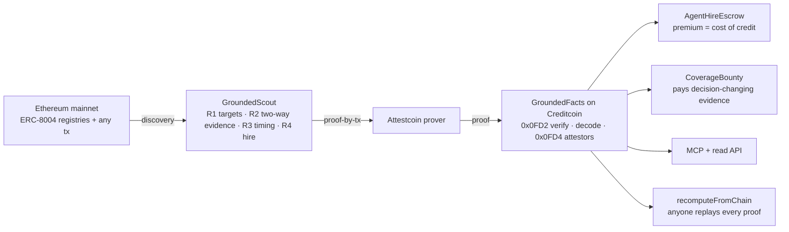

# Tinjau: verified background checks for AI agents, from facts proven from Ethereum into Creditcoin

Tinjau tells a contract or an agent, before money moves, whether an AI agent on the ERC-8004 registry deserves to be hired, and at what price, without trusting any score publisher. Every fact about the agent and its reviewers enters Creditcoin only through an Attestcoin proof of an Ethereum transaction, and anyone can recompute every number from the same proofs.

BUIDL CTC 2026 Fall · track AI · Creditcoin CC3 Testnet + Attestcoin Protocol

**Live:** [tinjau.xyz](https://tinjau.xyz) · **Whitepaper:** [whitepaper.pdf](https://tinjau.xyz/whitepaper.pdf) · **Deck:** [deck.pdf](https://tinjau.xyz/deck.pdf)

## Why a background check, and why Creditcoin

Creditcoin began as a credit history for borrowers that banks cannot see. AI agents are the next borrowers with no readable history. Over 19,000 are registered on ERC-8004, other agents hire and pay them, and nothing a contract can check says which ones deserve trust. Tinjau is the bureau in Creditcoin's sense, not the lender and not the judge: it records proven facts, separates them from the evidence that is still missing, and the party taking the risk sets the price. The hiring escrow is the pricing step; its premium is the agent's cost of credit.

## Problem

The ERC-8004 reputation registry on Ethereum mainnet is live, and nobody can read it raw. Of the last 600 reviews, 346 of 367 agents had exactly one reviewer and one wallet wrote 225 reviews; 16 of 105 reviewers own agents and wrote 59% of all feedback; in 60 days, owners holding ten or more agents made 83% of new registrations (RPC measurement, 29 Aug 2026; arXiv 2606.26028 finds 73.5% coordinated Sybil reviewers on Ethereum). The standard's answer is to aggregate off-chain and trust the aggregator.

## Solution

- **`GroundedFacts`** (Creditcoin) admits data only through Attestcoin proofs of Ethereum transactions from the official ERC-8004 registries. It records which reviews exist, how long each reviewer was active before reviewing, whether review indices have holes, whether a reviewer owns agents, and how many agents share an owner, registrant, URI or minting transaction, plus the number of attestors registered on Creditcoin when each fact was admitted. It computes no score: callers pass thresholds and get numbers back.
- **`AgentHireEscrow`** turns facts into a premium (the agent's cost of credit, paid to the agent's owner) and refuses hires when a reviewer's record has holes, when facts are stale, or when they were admitted while too few attestors were registered.
- **`CoverageBounty`** pays whoever submits proofs that change a consumer's decision, in either direction.
- **`GroundedScout`** (autonomous agent) picks targets (open bounties first), gathers evidence that helps and evidence that hurts, skips proofs other scouts already admitted, proves only when a bounty covers gas, and hires on its own thresholds.
- **MCP server** (`tinjau_facts`, `tinjau_quote`, `tinjau_verify`) and a **read API** let any agent query the bureau; a Gemini-based **claim reader** checks payment claims inside review documents against the Attestcoin prover and precompile (a report, never a fact). Run live on agent 50283: 6 payment claims, 6 of them on no chain Attestcoin can find them.

## Who fills the bureau in

Anyone can bring evidence; nobody can invent it. A scout (Tinjau runs its own, unattended, every three hours until the deadline (a launchd job on the builder's machine); anyone else may run one) only carries Attestcoin proofs of Ethereum transactions. The BlockProver precompile checks each proof before a byte of it is read, and logs count only from the official ERC-8004 registries, so a lying scout cannot insert a review that never happened. All a dishonest scout can do is withhold evidence, and the registry's own review counter exposes the holes it leaves (`gapCount`). Contributions change how complete the record is, never how correct it is.

## How it works



## Verified on testnet (13 Sep 2026)

| Agent | What the bureau proved | Result |
|---|---|---|
| 22771 | 3 reviewers active 97 days to 4 years before their first review, no holes, no clones | premium 1% (100 bps), hired by the scout |
| 21548 | same, after the scout claimed an open bounty with the decisive proof batch | premium 1%, hired |
| 50283 | one reviewer who owns agents, with review #97 proven and #1–96 not; owner holds 9 other agents | quote 20% (2,000 bps), `hire` reverts `Gated(1)` |

33 source transactions admitted as of 13 Sep 2026, all Ethereum mainnet, back to March 2022, every one recomputed off-chain from the chain alone with identical results. The scout keeps running on a schedule until the submission deadline, so the admitted-transaction count only grows; every number here is a floor, not a ceiling. The same proof verifies on CC3 **mainnet**. Transactions, gas and precompile details: [`ATTESTCOIN_INTEGRATION.md`](ATTESTCOIN_INTEGRATION.md).

## Contract addresses (Creditcoin CC3 Testnet, chainId 102031, verified)

| Contract | Address |
|---|---|
| GroundedFacts | `0x67394eC13E911ab0D3A26132BECa404F26e17a98` |
| AgentHireEscrow | `0xF801a8a01E018f3Bf9a648F4C095a53979282EEA` |
| CoverageBounty | `0xa27f14CD50BF334E7Fb09601cEf203745aADF569` |
| ERC-8004 Identity / Reputation, Ethereum mainnet (read via proofs, chainKey 3) | `0x8004A169…a432` / `0x8004BAa1…9b63` |

## Run locally

```bash
pnpm install
pnpm test:contracts                                  # 49 Foundry tests, real prover txBytes fixtures
pnpm --filter @tinjau/core test                      # off-chain model = contract on the same fixtures
cd services/scout
pnpm scout scout --agents=22771,50283 --maxTargets=2 # dry-run: decisions and proofs, no key needed
pnpm scout verify 22771 50283 21548                  # recompute facts and compare with the contract
cd ../../apps/server && pnpm dev                     # read API on :8787 (GET /facts/3/22771)
cd ../mcp-server && pnpm stdio                       # MCP server over stdio
cd ../web && pnpm dev                                # frontend on :5173
```

Live mode (`--live`) and `scripts/deploy.sh` need `PRIVATE_KEY` in `.env` (see `.env.example`). Deploys use `forge create --broadcast`: forge's script simulation rejects Creditcoin block headers.

## Repository

| Path | What |
|---|---|
| `contracts/` | Foundry: `GroundedFacts`, `AgentHireEscrow`, `CoverageBounty`, `IAgentFacts`; tests with real proof fixtures |
| `packages/core` | chain config, prover client, txBytes decoder, off-chain facts model, contract client, `recomputeFromChain` |
| `services/scout` | GroundedScout CLI (runs locally; holds the key) |
| `apps/server` | Hono read API + Gemini claim reader + `/card/:agentId` registration proxy; runs locally, deployable as Vercel Functions (not deployed today) |
| `apps/mcp-server` | MCP tools (stdio and stateless HTTP) |
| `apps/web` | frontend, live at [tinjau.xyz](https://tinjau.xyz): marketplace, bounty board, comparison, wallet flows |
| `docs/` | whitepaper, deck, evaluation dossier, demo script, task tracker, development guide |

## What was built during the hackathon

All code in this repository was written during BUIDL CTC 2026 Fall. The v3 rebuild started on 11 Sep 2026 from an empty repository. Vendored, not written by us: `contracts/lib/usc/` (`EvmV1Decoder`, `INativeQueryVerifier` from `@gluwa/usc-contracts` 0.2.0) and `contracts/lib/forge-std`. The dynamic-premium idea reuses a pattern from the author's earlier Veritas (UHI9) work, without its insurance reserve.

## Known limitations

- Ethereum mainnet only. Sepolia was dropped on 12 Sep 2026 on purpose: a Sepolia registry entry costs nothing to mint, so admitting it would let anyone fabricate a record for free (`scripts/deploy.sh`). Base has far more ERC-8004 activity and is out of Attestcoin's reach today.
- Facts are **admitted evidence with known gaps, never a complete history**. Contiguous review indices prove there is no hole below the highest proven index; they do not prove that index is the registry's latest. A review nobody has proven yet is invisible. Bounties pay for proving more.
- `minAttestors` is the number of attestors registered for the source chain when each proof was admitted (the lowest such number across the agent's facts). It is network context at admission, not the set of signers behind a specific proof.
- `coveredThrough` is the highest Ethereum block among the agent's proven facts. Its distance from the attested tip is the age of the newest proven fact; it does not mean every block up to it was examined.
- Clone density is a lower bound; aged wallets can be bought; honest multi-agent operators look like clone farms. The contract reports facts, not verdicts.
- `facts()` examines at most 256 reviewers (`truncated`), and the escrow refuses truncated facts.
- No consumer contract exists on Creditcoin today; the escrow is an example. Attestcoin moves trust to Creditcoin's bonded attestors (4 for Ethereum on testnet, 7 on mainnet with a minimum bond of 0); it does not remove trust.

## Evidence Exchange: what is live, what is not

The core of the counter-evidence market is deployed: `CoverageBounty.fund` opens an evidence request with policy thresholds, an expiry and a bounty; `decisionOf` is the four-predicate decision vector; `proveAndClaim` pays only if the proofs submitted in that call flip a predicate, in either direction (live: the scout's claim `0x8a32b470…d68d` on agent 21548, followed by the hire from the same facts). Ownership conflicts already resolve by source order `(height, txIndex, logIndex)`, whatever order proofs arrive in (tested, not yet shown live). Not built: a `proveBatchAndClaim` path on top of `recordBatch`, an adjudication receipt that records the decision before, the decision after and the predicate that flipped, and re-pricing the hire inside the same transaction as the claim.

License: MIT.
